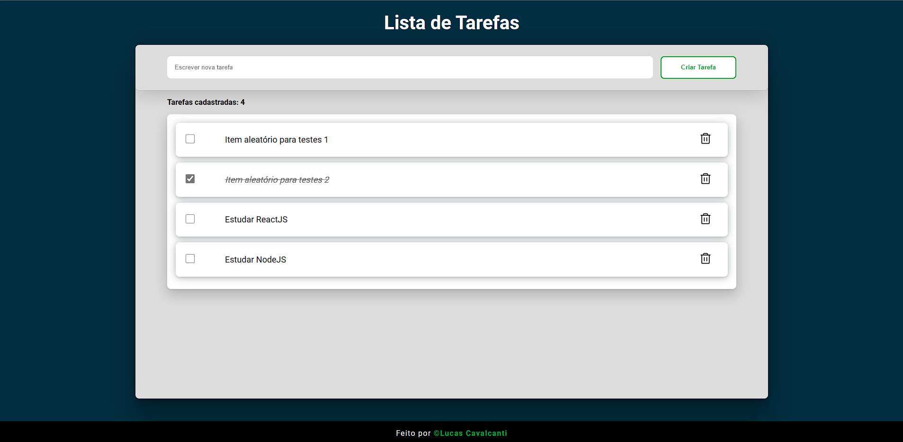

<h1>
    <a href="https://lucastodolist.netlify.app/" alt="Lista de Tarefas">
        
    </a>
    <p align="center">Projeto To-Do List</p>
</h1>

## 📕 Sobre
    
<p align="center">O projeto (To Do List) foi criado no intuito de praticar os aprendizados básicos em ReactJS e TypeScript.</p>

<br/>

## 🔨 Ferramentas

-   [Node](https://nodejs.org/en/)
-   [React](https://reactjs.org/)
-   [Vite](https://vitejs.dev/)
-   [Phosphor-Icons](https://phosphoricons.com/)
-   [TypeScript](https://www.typescriptlang.org/)

<br/>

## ♻ Como contribuir?

```bash
    #Clone the project
    $ git clone https://github.com/lcavalcanti393/ToDo-List
```

```bash
    #Enter the directory
    $ cd ToDo-List
```

```bash
    #Install the dependencies
    $ npm install
```

```bash
    #Start the app
    $ npm run dev
```